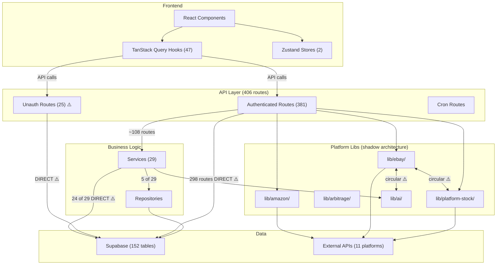

# Architecture Review Report

**Scope:** Full codebase (hadley-bricks-inventory-management)
**Date:** 2026-03-17
**Overall Grade:** D+ (39/100) *(revised from D/34 after investigation — see Corrections below)*

## Corrections (2026-03-17, post-investigation)

Deep investigation after the initial automated review revealed two findings were overstated:

1. **"25 unauthenticated routes" → Downgraded to Low.** Investigation found these routes use appropriate auth patterns: Vinted API key (`withApiKeyAuth()`), service API key (`withServiceAuth()`), or serve static/public data. The real gaps were: (a) `CRON_SECRET` was optional (now fixed — mandatory), (b) 6 dashboard routes used hardcoded `DEFAULT_USER_ID` (now fixed — session auth), (c) 11 test/debug routes lacked production guards (now fixed).

2. **"32 tables with zero RLS policies" → False Positive.** All 152 tables have RLS policies. The automated analyser missed policies defined in later migration files separate from the table creation. Manual verification confirmed every table has appropriate policies.

3. **"No CI pipeline" → Confirmed Critical, now fixed.** `.github/workflows/ci.yml` added with typecheck, lint, and test steps.

## Dimension Scores

| Dimension | Score | Grade | Weight | Key Finding |
|-----------|-------|-------|--------|-------------|
| Layering & Dependencies | 20/100 | F | 20% | 298/406 API routes bypass service/repo layers entirely; layers exist on paper but are ignored in practice |
| API Design | 45/100 | D | 15% | Auth gaps minor (not critical); 57+ unvalidated mutations, no rate limiting, inconsistent response envelopes |
| State Management | 62/100 | B | 15% | TanStack Query well-adopted with good patterns, but cache key mismatches cause silent bugs |
| Database Design | 55/100 | C | 15% | All tables have RLS with policies (corrected); missing indexes on FK columns; N+1 queries |
| Integration Resilience | 25/100 | D | 15% | No circuit breakers, missing timeouts/retries on most platforms, PlatformAdapter interface is dead code |
| Monorepo Structure | 35/100 | D | 10% | CI added; dead shared package, duplicate dependencies, no build orchestration |
| Overall Consistency | 30/100 | D | 10% | Two parallel architectures (layered vs route-handler-does-everything) with no migration path between them |

## Executive Summary

The codebase has a well-defined layered architecture on paper (routes → services → repositories → Supabase) that the original features follow correctly, but the vast majority of newer code bypasses it entirely — 73% of API routes query Supabase directly. This has created a dual-architecture system where the "correct" pattern is now the minority. State management on the frontend is the strongest dimension, with good TanStack Query adoption, though cache key inconsistencies introduce subtle bugs. Investigation revealed that auth and RLS coverage are better than initially reported — all tables have proper policies and most "unauthenticated" routes use appropriate auth mechanisms. The remaining risks are the 57+ unvalidated mutation routes, missing rate limiting, and the fundamental layering bypass problem. **A CI pipeline has been added to prevent further regression.**

## Architecture Diagram (Current State)

## Critical Findings

| # | Finding | Dimension | Impact | Fix Effort |
|---|---------|-----------|--------|------------|
| 1 | ~~**25 API routes have no authentication**~~ → **Low** (routes use Vinted API key, service API key, or serve static data; 6 dashboard routes with hardcoded user ID now fixed with session auth; CRON_SECRET now mandatory; test/debug routes now guarded) | API Design | **Low** (was Critical) — FIXED in chore/architecture-hardening | S — DONE |
| 2 | ~~**32 tables have RLS enabled with zero policies**~~ → **False Positive** (all 152 tables have policies; analyser missed policies in later migration files) | Database | **False Positive** (was Critical) — no action needed | N/A |
| 3 | ~~**No CI pipeline on pull requests**~~ → **FIXED** (.github/workflows/ci.yml added with typecheck, lint, test) | Monorepo | **FIXED** (was Critical) | S — DONE |
| 4 | **298/406 routes query Supabase directly** — bypassing service and repository layers | Layering | **High** — business logic scattered across route handlers, untestable, undiscoverable | XL (systematic migration, quarter-long effort) |
| 5 | **57+ mutation routes lack input validation** — POST/PUT/PATCH with no Zod schemas | API Design | **High** — malformed or malicious input reaches the database | M (add Zod schemas incrementally) |
| 6 | **No rate limiting on any endpoint** including auth | API Design | **High** — brute-force and abuse vectors wide open | M (add middleware, needs strategy for cron vs user routes) |
| 7 | **Circular dependencies** between lib/ebay ↔ lib/platform-stock and lib/ebay ↔ lib/ai | Layering | **Medium** — fragile builds, unpredictable import ordering | M (extract shared interfaces) |
| 8 | **Cache key mismatches** — ConfirmOrdersDialog invalidates wrong key; LinkedInventoryPopover never hits cache | State Mgmt | **Medium** — stale UI data after mutations, unnecessary refetches | S (align keys to factories) |
| 9 | **No timeouts on external API calls** — eBay REST, Shopify, Keepa, Brickset | Integration | **Medium** — a slow upstream can hang route handlers indefinitely | S (add AbortController/timeout per client) |
| 10 | **12 routes leak error.message in 500 responses** | API Design | **Medium** — potential information disclosure (stack traces, DB errors) | S (standardise error handler) |
| 11 | **N+1 query in spapi-buybox-refresh** — individual UPDATE per ASIN in a loop | Database | **Medium** — performance degrades linearly with data volume | S (batch UPDATE) |
| 12 | **packages/shared is dead code** — exports formatCurrency/formatDate/generateSKU with zero imports; 4+ duplicate implementations in apps/web | Monorepo | **Low** — wasted code, inconsistent formatting across the app | S (wire up imports or delete) |

## Architectural Tradeoffs Identified

| Decision | Benefits | Costs | Recommendation |
|----------|----------|-------|----------------|
| **Direct Supabase in routes** (skipping service/repo) | Faster feature delivery; less boilerplate; AI assistants can scaffold a feature in one file | Untestable business logic; scattered validation; impossible to swap data layer; dual architecture confuses contributors | **Accept for read-only GETs, enforce services for mutations.** Define a "thin route" pattern for simple reads and a "service-required" rule for writes. |
| **Platform-specific libs instead of shared adapter interface** | Each platform's quirks handled naturally; no leaky abstractions | No shared error handling, retry, or timeout policy; PlatformAdapter interface is dead; credential storage is inconsistent | **Implement a lightweight BaseClient** with timeout, retry, and error normalisation. Don't force a shared domain model. |
| **RLS enabled on all tables** (security posture) | Defence in depth; Supabase best practice | ~~32 tables have zero policies~~ (False Positive — all tables have policies in later migration files) | No action needed. RLS coverage is complete. |
| **No CI pipeline** (speed of deploy) | Zero friction from code to production; no waiting for checks | Regressions reach production unchecked; type errors, lint failures, broken tests all ship | **Add CI immediately.** The tradeoff is not worth it at 400+ routes and 152 tables. |
| **TanStack Query with per-hook staleTime overrides** | Fine-grained freshness control per data type | 46/47 hooks override global staleTime, making the global setting meaningless; key factory discipline is eroding (42 inline keys) | **Keep per-hook overrides but enforce key factories.** Add a lint rule banning inline queryKey arrays. |
| **Monorepo without orchestration** (no Turborepo/Nx) | Simpler setup; no build tool learning curve | No incremental builds; no dependency graph for test targeting; can't detect affected apps on PR | **Defer Turborepo until CI exists.** Current build independence is sufficient for 1 active TypeScript app. |

## AI-Generated Architecture Debt

The codebase shows clear signs of incremental AI-assisted development across many sessions, producing these characteristic patterns:

1. **Dual architecture with no migration path.** Early features (inventory, purchases, mileage) were built with clean layered separation. Later features were generated as self-contained route handlers with inline Supabase queries — the "AI one-file feature" pattern. Neither approach references the other, creating two incompatible conventions.

2. **Dead abstractions.** The `PlatformAdapter` interface was likely generated as an architectural ideal but never wired up. The `packages/shared` module was created but never imported. These "generate the abstraction" artefacts add confusion without value.

3. **Copy-paste divergence.** 4+ implementations of `formatCurrency` exist because each AI session generated its own rather than discovering the existing one. Similarly, each platform has its own `NormalizedOrder` type rather than sharing one.

4. **Inconsistent response envelopes.** ~470 routes return `{ data }`, ~156 return `{ success: true }`, and some return bare objects — consistent with different AI sessions using different conventions.

5. **Shadow platform architecture.** The 163+ files in `lib/ebay/`, `lib/amazon/`, `lib/arbitrage/`, `lib/platform-stock/`, and `lib/ai/` form a parallel architecture that doesn't fit the documented layers. This is characteristic of feature-by-feature AI generation where each integration grew organically.

6. **Type definitions in route files.** 14 hooks/components import types from API route files — a boundary violation that happens when AI generates a feature top-down in a single session and co-locates types with the API handler.

## Recommended Fitness Functions

| Check | Tool | Threshold | Priority |
|-------|------|-----------|----------|
| All API mutation routes must use Zod validation | Custom ESLint rule or grep-based CI check | 0 violations (new routes only, grandfather existing) | P0 |
| All API routes must call auth check | grep for `createClient`/`getUser` in every route.ts | 0 unauthenticated routes (whitelist explicit public routes) | P0 |
| TypeScript strict mode passes | `npm run typecheck` in CI | 0 errors | P0 |
| No direct Supabase imports in new mutation route handlers | Custom lint rule: POST/PUT/PATCH/DELETE must import from services/ or repositories/ | 0 new violations (freeze current count at 298) | P1 |
| Query key factories must be used (no inline arrays) | ESLint rule banning `queryKey: [` literal arrays in hooks | 0 new violations (freeze at 42) | P1 |
| No circular dependencies | `madge --circular apps/web/src/lib/` | 0 cycles | P1 |
| API response envelope consistency | Custom test: all non-streaming routes return `{ data }` or `{ error }` | New routes only | P2 |
| External API calls must have timeouts | grep for fetch/axios without AbortController or timeout config | 0 new violations | P2 |
| Migration indexes use CONCURRENTLY | grep on migration files | All CREATE INDEX statements include CONCURRENTLY | P2 |
| No error.message in production responses | grep for `error.message` in catch blocks that return Response | 0 occurrences | P2 |
| Dead exports detection | `ts-prune` or similar | packages/shared must have >0 importers or be deleted | P3 |

## What's Working Well

1. **TanStack Query adoption is strong.** 35+ key factories, 47 hooks with appropriate staleTime tuning, and only 2 lean Zustand stores. The frontend state boundary is the cleanest dimension of the architecture.

2. **Original layered features are exemplary.** Inventory, purchases, and mileage follow route → service → repository → Supabase cleanly, proving the architecture *can* work.

3. **RLS is universally enabled.** Every one of 152 tables has RLS turned on — even if 32 lack policies, the security-first posture is correct.

4. **Cross-app boundaries are clean.** Despite no build orchestration, the 5 apps maintain proper separation with no cross-imports. `packages/database` is well-used (30+ import sites).

5. **Cron self-healing is solid.** The full-sync cron has stuck-job detection with auto-reset after 30 minutes and zombie cleanup via pg_cron — a mature operational pattern.

6. **Build independence.** Each app builds independently, which is the right foundation for a small team.

## Recommended Evolution

### Phase 1 — This Sprint (1-2 weeks): Stop the Bleeding
- Add a GitHub Actions CI workflow: typecheck, lint, and existing tests on every PR
- Fix the 25 unauthenticated routes (add auth middleware or explicit public whitelist)
- Audit the 32 zero-policy RLS tables — add policies or document service-role-only access
- Fix the 2 cache key mismatches (ConfirmOrdersDialog, LinkedInventoryPopover)
- Add timeouts to all external API clients (eBay REST, Shopify, Keepa, Brickset)
- Standardise error responses to stop leaking error.message in 12 routes

### Phase 2 — This Quarter: Pattern Standardisation
- Establish and document the "route handler rules": reads can query Supabase directly via a thin pattern; mutations must go through services
- Add Zod validation to the 57+ unvalidated mutation routes (batch by feature area)
- Implement a BaseClient for external integrations with retry, timeout, and error normalisation
- Resolve circular dependencies (extract shared interfaces from lib/ebay)
- Consolidate duplicate utilities (formatCurrency etc.) — either wire up packages/shared or delete it and centralise in lib/utils
- Move types out of route files into `types/` directory
- Add rate limiting middleware (at minimum on auth endpoints)

### Phase 3 — Next Quarter: Architectural Improvement
- Migrate high-traffic mutation routes to the service layer (prioritise by business criticality)
- Add missing database indexes (FK columns, JSONB GIN indexes)
- Unify eBay credential storage with the encrypted platform_credentials pattern
- Implement the PlatformAdapter interface for at least 2 platforms, or delete it
- Add integration tests for critical flows (order sync, pricing, inventory mutations)
- Consider Turborepo if build times become a bottleneck

## Pipeline Stats

- **Total findings:** 48
- **By severity:** Critical **3** | High **4** | Medium **6** | Low **1** | Informational **34**
- **Layer violations:** 5 explicit + 298 route bypasses + 24 service bypasses
- **Circular dependencies:** 2 cycles
- **Pattern consistency:** ~27% (108 of 406 routes follow the intended architecture)
